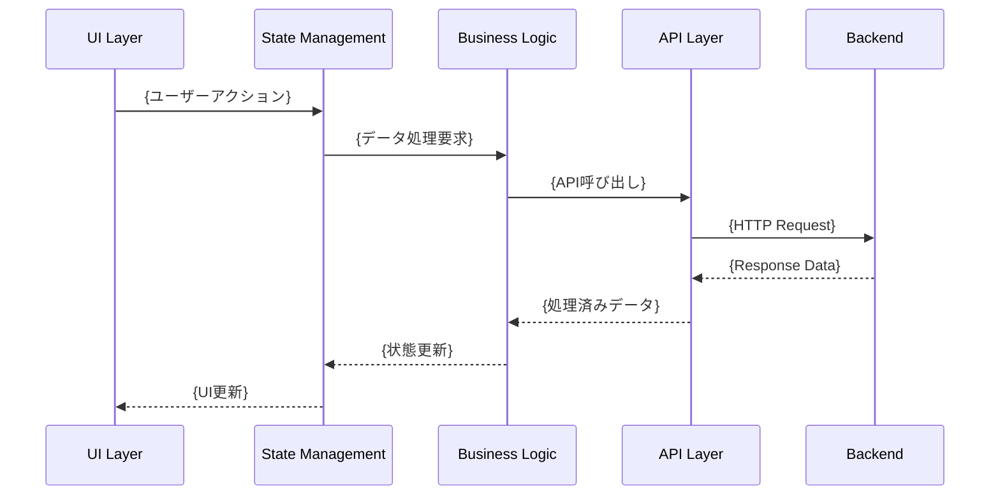

# Feature Design Templates

このディレクトリには、機能設計・実装系のドキュメントテンプレートが含まれています。

## 📋 利用可能なテンプレート

### API設計
- **[API設計テンプレート](./api-template.md)** - RESTful API、GraphQL API設計書

### コンポーネント設計
- **[コンポーネント設計テンプレート](./component-template.md)** - UI/システムコンポーネント設計書

### データ設計
- **[データモデルテンプレート](./data-model-template.md)** - データベース設計・データ構造定義

### 機能仕様
- **[機能仕様書テンプレート](./specifications.md)** - 詳細な機能仕様書
- **[データフローテンプレート](./data-flow.md)** - データフロー・状態管理設計

## 🚀 使用方法

1. 機能の設計段階に応じてテンプレートを選択
2. 機能固有の技術要件に更新
3. 設計仕様と要件を具体的に記載
4. チーム全体でレビュー可能な形式で文書化

## 🔗 関連リソース

- **[Feature UI Templates](../ui/)** - UI設計テンプレート
- **[Feature Test Templates](../test/)** - 機能テストテンプレート
- **[Project Templates](../../)** - プロジェクト概要系テンプレート
    
    subgraph "Logic Layer"
        D[Business Logic] --> E[Data Processing]
        E --> F[Validation]
    end
    
    subgraph "Data Layer"
        G[Local State] --> H[API Client]
        H --> I[Cache Management]
    end
    
    A --> D
    D --> G
```

## 🔄 データフロー概要

### 主要データフロー



## 🎯 主要機能仕様

### 機能要件

| 機能 | 要件 | 制約・条件 | 優先度 |
|------|------|-----------|--------|
| {機能1} | {要件詳細} | {制約事項} | 🔴高 |
| {機能2} | {要件詳細} | {制約事項} | 🟡中 |
| {機能3} | {要件詳細} | {制約事項} | 🟢低 |

### 非機能要件

| 項目 | 要件 | 測定方法 |
|------|------|----------|
| **パフォーマンス** | {パフォーマンス要件} | {測定方法} |
| **可用性** | {可用性要件} | {測定方法} |
| **セキュリティ** | {セキュリティ要件} | {測定方法} |

## 🔧 技術仕様

### 使用技術

```yaml
@technical_stack
frontend:
  - Flutter/Dart
  - Riverpod (状態管理)
  - {その他のライブラリ}
backend_integration:
  - {API仕様}
  - {データ形式}
  - {認証方式}
dependencies:
  - {依存パッケージ1}
  - {依存パッケージ2}
```

### 設計制約

- {制約事項1}
- {制約事項2}
- {制約事項3}

## 🔐 セキュリティ設計

### セキュリティ要件

| 項目 | 要件 | 実装方法 |
|------|------|----------|
| **認証** | {認証要件} | {実装詳細} |
| **認可** | {認可要件} | {実装詳細} |
| **データ保護** | {データ保護要件} | {実装詳細} |

## 📊 品質要件

### パフォーマンス指標

| 指標 | 目標値 | 測定条件 |
|------|-------|----------|
| **レスポンス時間** | {目標値} | {条件} |
| **メモリ使用量** | {目標値} | {条件} |
| **CPU使用率** | {目標値} | {条件} |

### 信頼性要件

- {信頼性要件1}
- {信頼性要件2}
- {信頼性要件3}

## 🔗 関連ドキュメント

- **[機能設計概要](../README.md)** - 機能全体の設計書
- **[機能仕様書](./specifications.md)** - 詳細な機能要件
- **[データフロー設計](./data-flow.md)** - 状態管理詳細
- **[API連携設計](./api-integration.md)** - バックエンド連携
- **[テスト設計](./testing.md)** - 品質保証戦略
- **[UI設計](../ui/README.md)** - 画面設計

---

> **📝 このドキュメントについて**  
> {Feature Name}の設計仕様・アーキテクチャ書です。技術仕様と品質要件を包括的に定義しています。