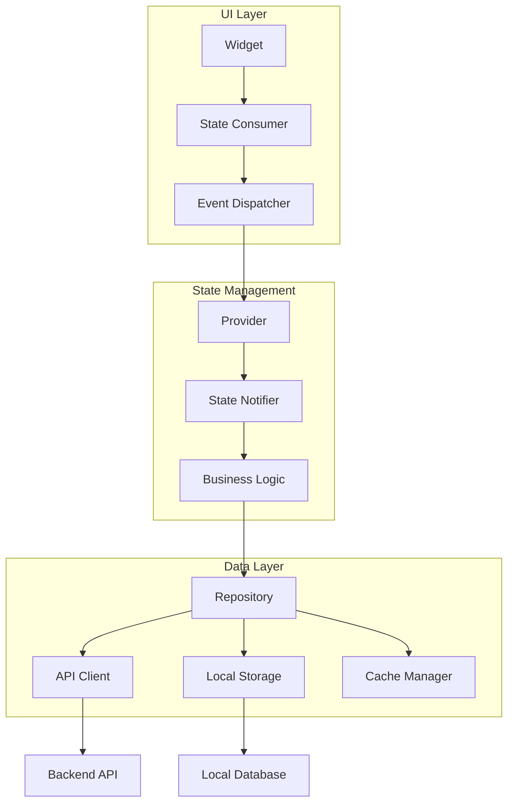
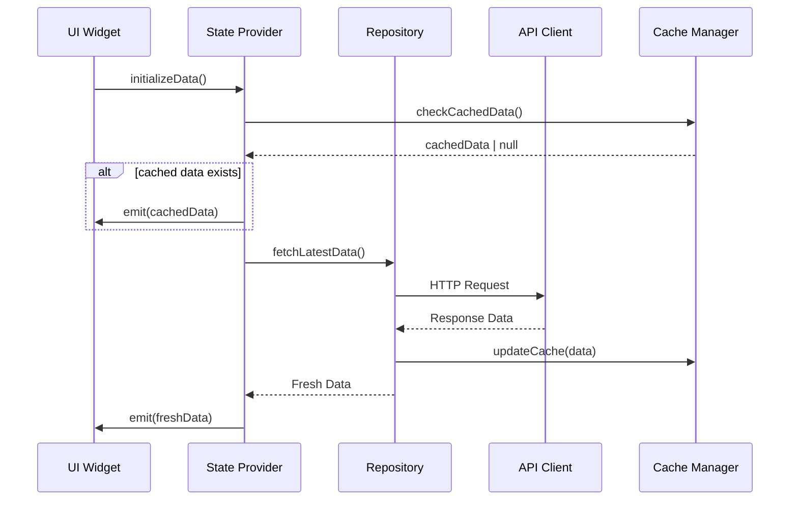
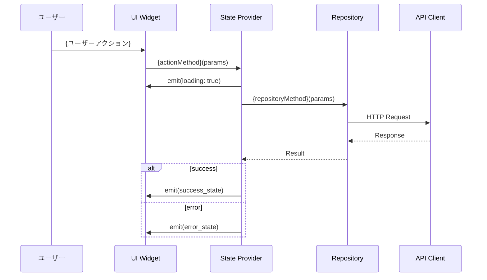
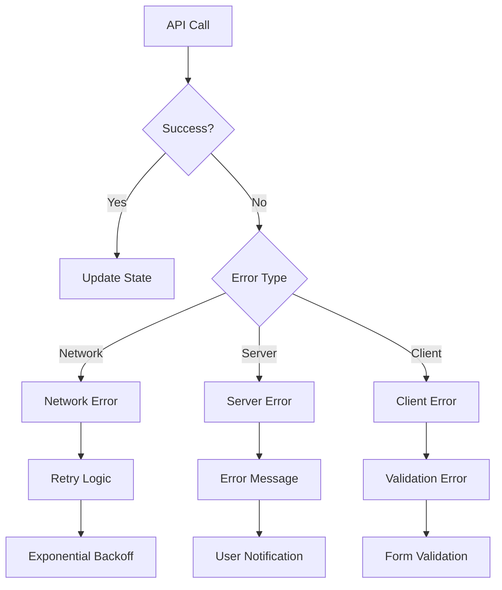

# {Feature Name} データフロー設計テンプレート

```yaml
@metadata
type: "data_flow_template"
version: "1.0.0"
intent: "{Feature Name}のデータフロー・状態管理詳細設計テンプレート"
context:
  project: "{project_name}"
  feature: "{feature_name}"
  layer: "data_architecture"
  parent: "./README.md"
  children: []
capabilities:
  - "データフロー設計"
  - "状態管理アーキテクチャ"
  - "API連携設計"
  - "エラーハンドリング"
  - "パフォーマンス最適化"
scope:
  - "データ流れの全体設計"
  - "状態管理戦略"
  - "API呼び出し制御"
  - "データ整合性確保"
```

## 📑 ナビゲーション

### 機能設計ドキュメント
- **[機能設計概要](./README.md)** - 機能設計全体ナビゲーション
- **[アーキテクチャ](./architecture.md)** - 技術アーキテクチャ詳細
- **[API仕様](./api-spec.md)** - API設計仕様

### 関連リソース
- **[UI設計](../ui/)** - ユーザーインターフェース設計
- **[テスト設計](../test/)** - データフローテスト計画
- **[機能概要](../README.md)** - 機能全体情報

状態管理とデータの流れを詳細に定義します。

## 🔄 データフロー概要

### 全体アーキテクチャ



## 📊 状態管理設計

### State Structure

```dart
@freezed
class {FeatureName}State with _${FeatureName}State {
  const factory {FeatureName}State({
    @Default([]) List<{DataType}> items,
    @Default(null) {DataType}? selectedItem,
    @Default(false) bool isLoading,
    @Default(false) bool hasError,
    @Default(null) String? errorMessage,
    @Default({}) Map<String, dynamic> metadata,
  }) = _{FeatureName}State;
}
```

### State Management Pattern

```dart
class {FeatureName}StateNotifier extends StateNotifier<{FeatureName}State> {
  {FeatureName}StateNotifier(this._repository) : super(const {FeatureName}State());

  final {FeatureName}Repository _repository;

  Future<void> {action1}({parameters}) async {
    state = state.copyWith(isLoading: true, hasError: false);
    
    try {
      final result = await _repository.{repositoryMethod}({parameters});
      state = state.copyWith(
        items: result,
        isLoading: false,
      );
    } catch (error) {
      state = state.copyWith(
        isLoading: false,
        hasError: true,
        errorMessage: error.toString(),
      );
    }
  }
}
```

## 🔄 データフロー詳細

### 初期化フロー



### ユーザーアクションフロー



### エラーハンドリングフロー



## 🗄️ データ永続化

### ローカルストレージ設計

```yaml
@local_storage
strategy: "hybrid" # cache-first, network-first, cache-only
cache_duration: "30m"
storage_types:
  - type: "SharedPreferences"
    usage: "user_settings"
  - type: "IndexedDB"
    usage: "application_data"
  - type: "Memory"
    usage: "temporary_state"
```

### キャッシュ戦略

```dart
class CacheStrategy {
  static const Duration defaultTTL = Duration(minutes: 30);
  
  // Cache-First Strategy
  Future<T> cacheFirst<T>(String key, Future<T> Function() fetcher) async {
    final cached = await _cache.get<T>(key);
    if (cached != null && !_isExpired(key)) {
      return cached;
    }
    
    final fresh = await fetcher();
    await _cache.set(key, fresh, ttl: defaultTTL);
    return fresh;
  }
  
  // Network-First Strategy  
  Future<T> networkFirst<T>(String key, Future<T> Function() fetcher) async {
    try {
      final fresh = await fetcher();
      await _cache.set(key, fresh, ttl: defaultTTL);
      return fresh;
    } catch (error) {
      final cached = await _cache.get<T>(key);
      if (cached != null) {
        return cached;
      }
      rethrow;
    }
  }
}
```

## 🔄 データ同期

### 同期戦略

```yaml
@sync_strategy
real_time:
  - "{リアルタイム同期が必要なデータ}"
  - "{即座に反映すべき変更}"
periodic:
  interval: "5m"
  data_types:
    - "{定期同期データ1}"
    - "{定期同期データ2}"
manual:
  - "{手動同期データ}"
  - "{ユーザートリガー}"
```

### 競合解決

```dart
class ConflictResolution {
  ConflictResolution resolveConflict(
    LocalData local,
    RemoteData remote,
  ) {
    // Last-Write-Wins strategy
    if (remote.updatedAt.isAfter(local.updatedAt)) {
      return ConflictResolution.useRemote(remote);
    }
    
    // Custom merge logic
    if (_canMerge(local, remote)) {
      return ConflictResolution.merge(_mergeData(local, remote));
    }
    
    // User intervention required
    return ConflictResolution.requireUserIntervention(local, remote);
  }
}
```

## 📡 API統合

### API呼び出しパターン

```dart
class {FeatureName}Repository {
  final ApiClient _apiClient;
  final CacheManager _cacheManager;
  
  Future<List<{DataType}>> fetch{DataType}s({
    int? page,
    int? limit,
    Map<String, dynamic>? filters,
  }) async {
    final cacheKey = _buildCacheKey('items', page, limit, filters);
    
    return _cacheManager.cacheFirst(
      cacheKey,
      () => _apiClient.get<List<{DataType}>>(
        '/api/{endpoint}',
        queryParameters: {
          if (page != null) 'page': page,
          if (limit != null) 'limit': limit,
          if (filters != null) ...filters,
        },
      ),
    );
  }
}
```

### レスポンス変換

```dart
class {DataType}Mapper {
  static {DataType} fromJson(Map<String, dynamic> json) {
    return {DataType}(
      id: json['id'],
      name: json['name'],
      // Field mapping logic
    );
  }
  
  static Map<String, dynamic> toJson({DataType} data) {
    return {
      'id': data.id,
      'name': data.name,
      // Reverse mapping logic
    };
  }
}
```

## 🧪 データフローテスト

### 状態変化テスト

```dart
void main() {
  group('{FeatureName}StateNotifier', () {
    late {FeatureName}StateNotifier notifier;
    late Mock{FeatureName}Repository mockRepository;
    
    setUp(() {
      mockRepository = Mock{FeatureName}Repository();
      notifier = {FeatureName}StateNotifier(mockRepository);
    });
    
    test('should update state correctly on successful data fetch', () async {
      // Arrange
      final testData = [/* test data */];
      when(() => mockRepository.fetchData()).thenAnswer((_) async => testData);
      
      // Act
      await notifier.fetchData();
      
      // Assert
      expect(notifier.state.items, equals(testData));
      expect(notifier.state.isLoading, isFalse);
      expect(notifier.state.hasError, isFalse);
    });
  });
}
```

## 🔗 関連ドキュメント

- **[設計概要](./README.md)** - アーキテクチャ概要
- **[機能仕様書](./specifications.md)** - 機能要件
- **[API連携設計](./api-integration.md)** - 外部API連携
- **[テスト設計](./testing.md)** - テスト戦略
- **[機能設計概要](../README.md)** - 機能全体設計

---

> **📝 このドキュメントについて**  
> {Feature Name}のデータフロー設計書です。状態管理とデータの流れを詳細に定義しています。