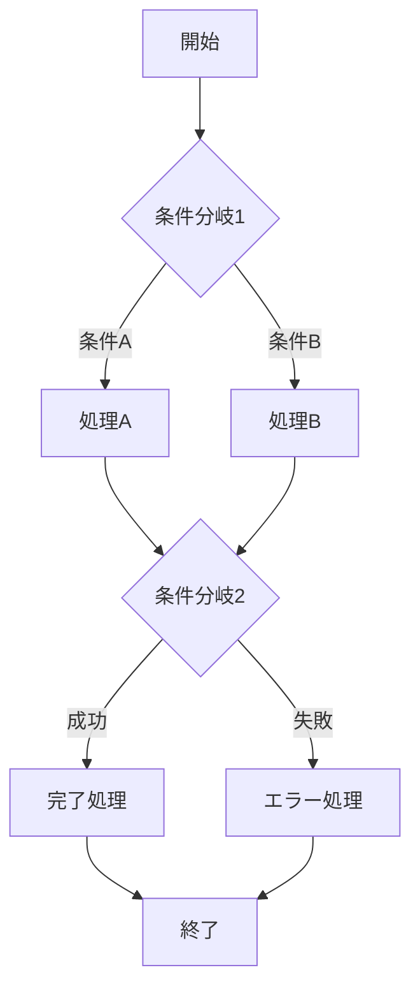

# {Feature Name} 機能仕様書テンプレート

```yaml
@metadata
type: "specification_template"
version: "1.0.0"
intent: "{Feature Name}の詳細機能要件・制約仕様定義テンプレート"
context:
  project: "{project_name}"
  feature: "{feature_name}"
  layer: "specification"
  parent: "./README.md"
  children: []
capabilities:
  - "機能要件の詳細定義"
  - "制約・条件の明確化"
  - "受け入れ基準策定"
  - "非機能要件管理"
  - "仕様トレーサビリティ"
scope:
  - "機能要件詳細"
  - "制約条件明確化"
  - "品質基準定義"
  - "パフォーマンス要件"
```

## 📑 ナビゲーション

### 機能設計ドキュメント
- **[機能設計概要](./README.md)** - 機能設計全体ナビゲーション
- **[データフロー](./data-flow.md)** - データ流れ・状態管理設計
- **[API仕様](./api-template.md)** - API設計詳細

### 関連リソース
- **[UI設計](../ui/)** - ユーザーインターフェース設計
- **[テスト設計](../test/)** - 機能テスト計画
- **[機能概要](../README.md)** - 機能全体情報

詳細な機能要件と制約を定義します。

## 📋 機能要件

### 主要機能

| 機能ID | 機能名 | 詳細説明 | 優先度 | 制約・条件 |
|--------|--------|----------|--------|-----------|
| {F-001} | {機能名1} | {詳細な機能説明} | 🔴高 | {制約事項} |
| {F-002} | {機能名2} | {詳細な機能説明} | 🟡中 | {制約事項} |
| {F-003} | {機能名3} | {詳細な機能説明} | 🟢低 | {制約事項} |

### 機能詳細仕様

#### {F-001} {機能名1}

```yaml
@function_spec
id: "{F-001}"
name: "{機能名1}"
description: "{詳細な機能説明}"
trigger: "{機能が発動する条件}"
input:
  - type: "{入力データ型}"
    description: "{入力データの説明}"
    validation: "{バリデーションルール}"
process:
  - step: 1
    action: "{処理ステップ1}"
    detail: "{詳細説明}"
  - step: 2
    action: "{処理ステップ2}"
    detail: "{詳細説明}"
output:
  - type: "{出力データ型}"
    description: "{出力データの説明}"
    format: "{出力形式}"
error_handling:
  - error: "{エラー種別1}"
    response: "{エラー対応}"
  - error: "{エラー種別2}"
    response: "{エラー対応}"
business_rules:
  - rule: "{ビジネスルール1}"
  - rule: "{ビジネスルール2}"
```

#### 使用ケース

```gherkin
Scenario: {シナリオ名}
  Given {前提条件}
  When {ユーザーアクション}
  Then {期待される結果}
  And {追加の確認事項}
```

#### {F-002} {機能名2}

```yaml
@function_spec
id: "{F-002}"
name: "{機能名2}"
description: "{詳細な機能説明}"
dependencies:
  - "{依存機能1}"
  - "{依存機能2}"
constraints:
  - "{制約事項1}"
  - "{制約事項2}"
```

## 🔒 非機能要件

### パフォーマンス要件

| 項目 | 要件 | 測定方法 | 目標値 |
|------|------|----------|--------|
| **レスポンス時間** | {要件詳細} | {測定方法} | {目標値} |
| **スループット** | {要件詳細} | {測定方法} | {目標値} |
| **メモリ使用量** | {要件詳細} | {測定方法} | {目標値} |
| **CPU使用率** | {要件詳細} | {測定方法} | {目標値} |

### 可用性要件

```yaml
@availability
uptime: "{稼働率目標}"
recovery_time: "{復旧時間目標}"
backup_frequency: "{バックアップ頻度}"
failover: "{フェイルオーバー要件}"
```

### セキュリティ要件

| 項目 | 要件 | 実装方法 |
|------|------|----------|
| **認証** | {認証要件} | {実装詳細} |
| **認可** | {認可要件} | {実装詳細} |
| **データ暗号化** | {暗号化要件} | {実装詳細} |
| **監査ログ** | {ログ要件} | {実装詳細} |

### ユーザビリティ要件

```yaml
@usability
accessibility:
  - "{アクセシビリティ要件1}"
  - "{アクセシビリティ要件2}"
user_experience:
  - "{UX要件1}"
  - "{UX要件2}"
learning_curve: "{習得しやすさの要件}"
error_prevention: "{エラー防止要件}"
```

## 📊 データ要件

### データモデル

```yaml
@data_model
{Entity1}:
  attributes:
    {attribute1}:
      type: "{type}"
      required: true
      description: "{説明}"
    {attribute2}:
      type: "{type}"
      required: false
      default: "{default_value}"
      description: "{説明}"
  relationships:
    - type: "has_many"
      target: "{Entity2}"
      foreign_key: "{key_name}"

{Entity2}:
  attributes:
    {attribute1}:
      type: "{type}"
      required: true
      description: "{説明}"
  relationships:
    - type: "belongs_to"
      target: "{Entity1}"
```

### データバリデーション

| フィールド | バリデーションルール | エラーメッセージ |
|------------|---------------------|-----------------|
| {field1} | {validation_rule} | {error_message} |
| {field2} | {validation_rule} | {error_message} |
| {field3} | {validation_rule} | {error_message} |

## 🔄 ビジネスプロセス

### プロセスフロー



### ビジネスルール

```yaml
@business_rules
rule_1:
  condition: "{条件}"
  action: "{実行アクション}"
  exception: "{例外処理}"
rule_2:
  condition: "{条件}"
  action: "{実行アクション}"
  validation: "{検証ルール}"
```

## 🚫 制約・前提条件

### 技術制約

- {技術制約1}
- {技術制約2}
- {技術制約3}

### ビジネス制約

- {ビジネス制約1}
- {ビジネス制約2}
- {ビジネス制約3}

### 前提条件

- {前提条件1}
- {前提条件2}
- {前提条件3}

## ⚠️ リスク・課題

| リスク | 影響度 | 発生確率 | 対策 | 担当 |
|--------|--------|----------|------|------|
| {リスク1} | 🔴高 | 🟡中 | {対策内容} | {担当者} |
| {リスク2} | 🟡中 | 🔴高 | {対策内容} | {担当者} |

## 🔗 関連ドキュメント

- **[機能設計概要](../README.md)** - 機能全体設計
- **[設計概要](./README.md)** - アーキテクチャ概要
- **[データフロー設計](./data-flow.md)** - データの流れ
- **[API連携設計](./api-integration.md)** - 外部連携
- **[テスト設計](./testing.md)** - テスト戦略
- **[UI設計](../ui/README.md)** - ユーザーインターフェース

---

> **📝 このドキュメントについて**  
> {Feature Name}の詳細機能仕様書です。機能要件と非機能要件を包括的に定義しています。