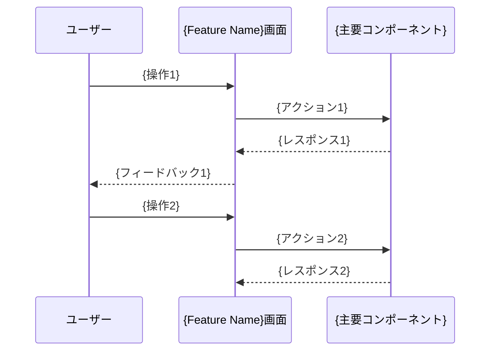

# {Feature Name} UI設計・レイアウト

画面レイアウトとUIコンポーネントの設計仕様を記載します。

## 📋 目次・ナビゲーション

### UI設計ドキュメント
- **[コンポーネント仕様](./components.md)** - 個別コンポーネントの詳細仕様
- **[レイアウト設計](./layouts.md)** - 画面レイアウトとワイヤーフレーム
- **[ワイヤーフレーム](./wireframes/)** - モックアップとビジュアルデザイン

### 関連設計
- **[機能設計概要](../README.md)** - 機能全体の設計書
- **[詳細仕様](../design/README.md)** - 技術仕様とアーキテクチャ

## 🎨 UI概要

{画面の全体的なUIコンセプトと設計方針}

## 📱 画面構成

### レイアウト構造

```mermaid
graph TB
    subgraph "{Feature Name}画面"
        A[ヘッダー部] --> B[メインコンテンツエリア]
        B --> C[フッター・アクション部]
        D[サイドパネル] --> B
    end
    
    subgraph "メインコンテンツ"
        E[{主要コンポーネント1}] --> F[{主要コンポーネント2}]
        F --> G[{主要コンポーネント3}]
    end
```

## 🧩 主要UIコンポーネント

### {コンポーネント1}

```yaml
@component: {component_name_1}
props:
  {prop1}: {type} # {説明}
  {prop2}: {type} # {説明}
state:
  {state1}: {type} # {説明}
  {state2}: {type} # {説明}
actions:
  - {action1}: {説明}
  - {action2}: {説明}
```

### {コンポーネント2}

```yaml
@component: {component_name_2}
props:
  {prop1}: {type} # {説明}
  {prop2}: {type} # {説明}
state:
  {state1}: {type} # {説明}
actions:
  - {action1}: {説明}
```

## 📐 レイアウト要件

### 画面サイズ対応

| デバイス | 幅 | レイアウト | 備考 |
|----------|----|-----------|----- |
| モバイル | ~768px | 縦1列 | {モバイル対応の詳細} |
| タブレット | 768px~1024px | 2列レイアウト | {タブレット対応の詳細} |
| デスクトップ | 1024px~ | 3列レイアウト | {デスクトップ対応の詳細} |

### アクセシビリティ要件

- {アクセシビリティ要件1}
- {アクセシビリティ要件2}
- {アクセシビリティ要件3}

## 🎭 インタラクション設計

### ユーザー操作フロー



## 🔗 関連ドキュメント

- **[機能設計概要](../README.md)** - 機能全体の設計書
- **[コンポーネント仕様](./components.md)** - 個別コンポーネント詳細
- **[レイアウト設計](./layouts.md)** - 詳細なレイアウト設計
- **[設計仕様](../design/specifications.md)** - 機能要件
- **[共通UI設計](../../common-ui/README.md)** - 共通コンポーネント

---

> **📝 このドキュメントについて**  
> {Feature Name}のUI設計・レイアウト仕様書です。画面構成とコンポーネント設計を定義しています。